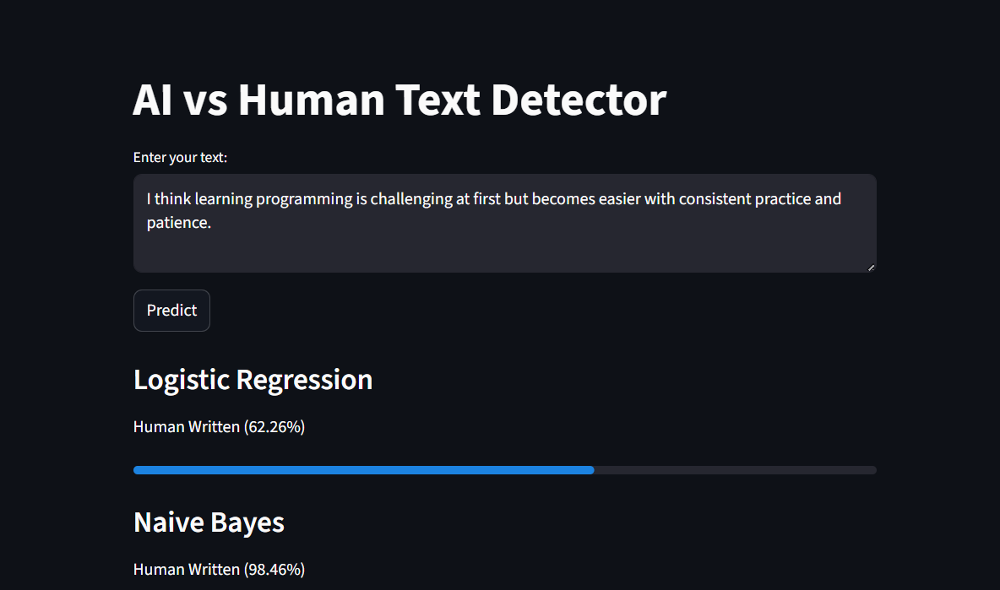
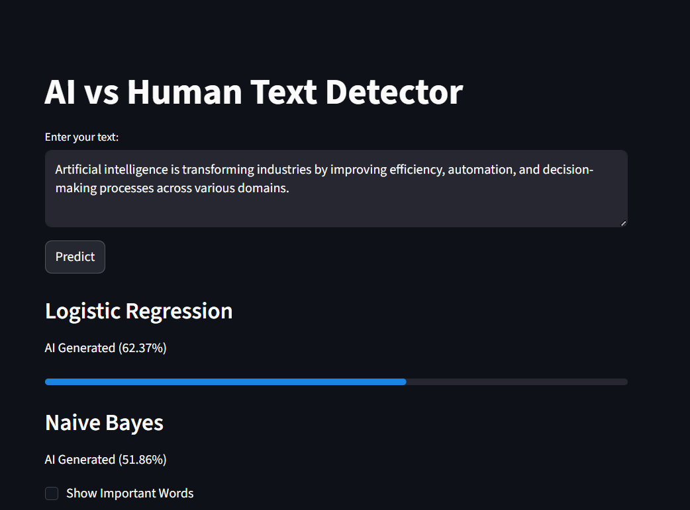

# AI vs Human Text Detector

A Machine Learning project that classifies whether a given text is AI-generated or human-written.

---

## Features
- Text preprocessing and cleaning
- TF-IDF feature extraction
- Logistic Regression and Naive Bayes models
- Confidence score prediction
- Streamlit web interface
- Model interpretability using top words

---

## How It Works
1. Input text is cleaned and preprocessed  
2. Converted into numerical features using TF-IDF  
3. Machine learning models predict the class  
4. Confidence score is displayed  

---

## Tech Stack
- Python  
- Scikit-learn  
- Streamlit  
- Pandas, NumPy  

---

## How to Run

### 1. Install dependencies
```
pip install -r requirements.txt
```

### 2. Train model
```
python train_model.py
```

### 3. Run app
```
python -m streamlit run app.py
```

---

## Project Structure
```
ai-vs-human-detector/
│
├── dataset/
│   └── ai_vs_human_text.csv
├── app.py
├── backend.py
├── train_model.py
├── model.pkl
├── nb_model.pkl
├── vectorizer.pkl
├── requirements.txt
└── README.md
```

---

## Important Note
The dataset was cleaned to remove label leakage (phrases like "AI-generated") to ensure fair model training.

---

## Demo


### Human Text Example


### AI Text Example

# ai-vs-human-detector
AI vs Human text detection using ML

